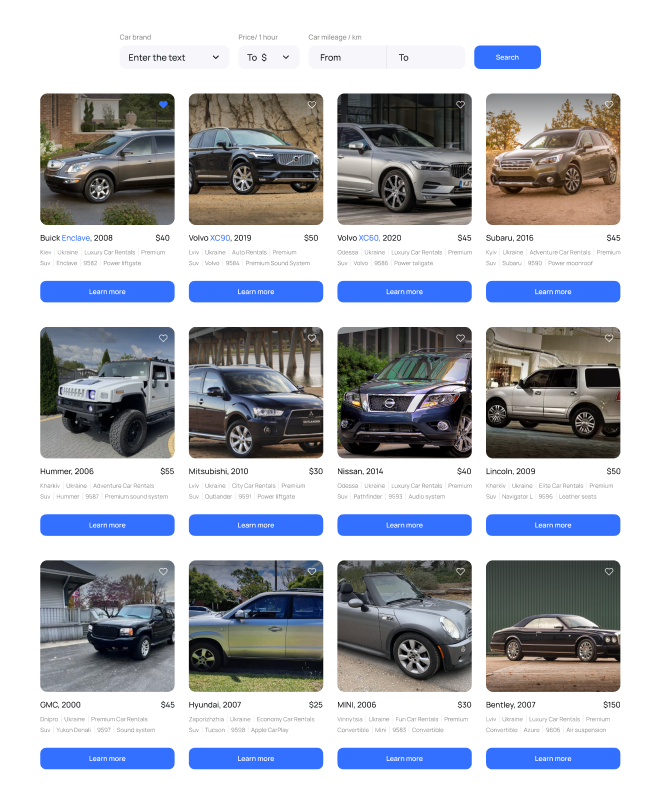

Застосунок для компанії, що надає послуги надання в Україні автомобілів в оренду. Застосунок складається з 3х сторінок:

Домашня сторінка з загальним описом послуг, що надає компанія. 
Сторінка, що містить каталог автівок різної комплектації, які користувач може фільтрувати за маркою, ціною за годину оренди авто та кількістю кілометрів, яку подолав автомобіль під час його експлуатації (пробіг).
Сторінка з оголошеннями, які були додані користувачем в улюблені Зовнішній вигляд програми повинен складатися з навігації(оформлення на ваш розсуд) та області перегляду.

